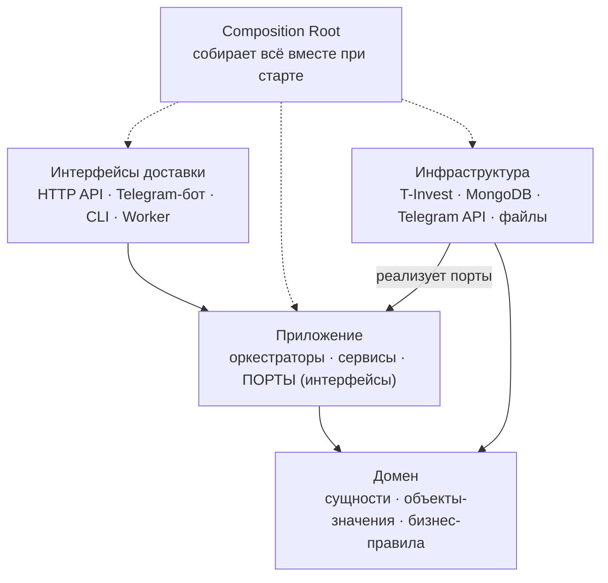
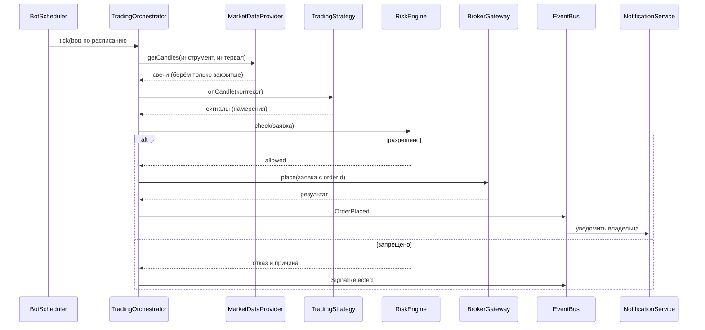
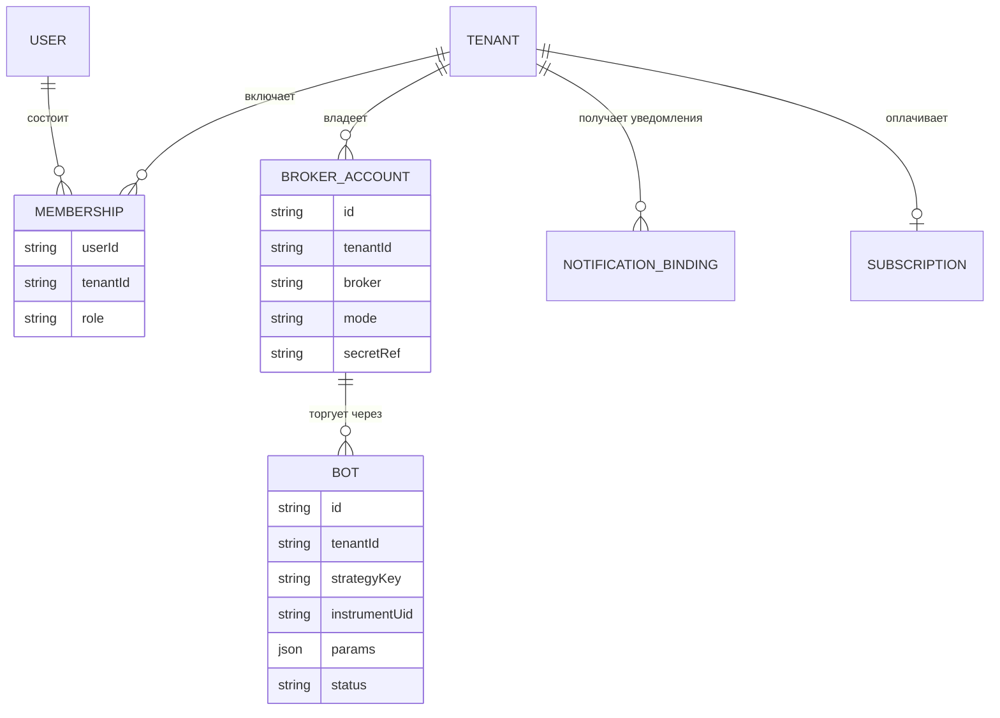
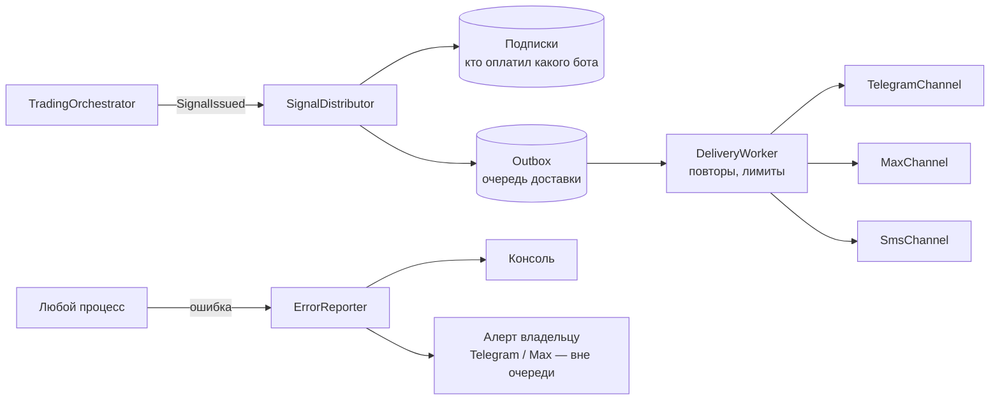

# Архитектура trader-agent

> Документ-учебник. Он описывает, **как устроен проект и почему именно так**. Каждое понятие
> сопровождается примером из нашего кода и аналогией из мира 1С.
> Читать сверху вниз. К разделам про паттерны стоит возвращаться, когда встречаете их в коде.

---

## 1. Главная идея в одном абзаце

Ядро робота (стратегии, риск-менеджмент, оркестрация торговли) **ничего не знает** о Т-Банке,
MongoDB, Telegram и даже о том, торгуем мы по-настоящему или прогоняем бэктест. Ядро объявляет,
что ему нужно: «дай свечи», «исполни заявку», «сообщи владельцу». Внешние детали подключаются
снаружи, как вилки в розетки. Отсюда название — **«порты и адаптеры»** (Hexagonal Architecture).

**Аналогия из 1С.** Так устроена БСП. Библиотека вызывает процедуры *переопределяемых модулей*
(`ОбщегоНазначенияПереопределяемый` и т.п.), но не знает, что в них напишет конкретная
конфигурация. Библиотека задаёт контракт, конфигурация даёт реализацию. Это и есть инверсия
управления, на которой держится весь наш проект.

Что это даёт на практике:

| Хотим… | Что меняем | Что НЕ трогаем |
|---|---|---|
| Бэктест вместо реальной торговли | Адаптер брокера: `SimulatedGateway` вместо `TInvestGateway` | Стратегии, риск, оркестратор |
| Подключить второго брокера (Финам) | Добавляем адаптер `FinamGateway` | Всё остальное |
| Уведомления в мессенджер Max вместо Telegram | Добавляем `MaxChannel` | Всё остальное |
| Хранить токены в зашифрованной БД, а не в `.env` | Меняем реализацию `SecretVault` | Всё остальное |

---

## 2. Слои и правило зависимостей



| Слой | Что внутри | Может импортировать | 1С |
|---|---|---|---|
| **Домен** | Сущности (`Order`, `Bot`), объекты-значения (`Money`), чистые правила | Только `shared/kernel` | Справочники и документы с их бизнес-логикой в модуле объекта |
| **Приложение** | Сценарии (use cases), оркестраторы, **порты** — интерфейсы того, что нужно от внешнего мира | Домен, `shared` | Обработки и общие модули с бизнес-сценариями |
| **Инфраструктура** | Адаптеры: клиент T-Invest, репозитории MongoDB, отправка в Telegram | Порты приложения, домен | Внешние компоненты, обмены, HTTP-запросы к чужим сервисам |
| **Интерфейсы доставки** | HTTP-контроллеры, команды бота, CLI | Приложение | HTTP-сервисы, формы, команды |
| **Composition Root** | Создаёт конкретные классы и связывает их | Всё | Модуль приложения / процедура при начале работы системы |

**Главное правило: стрелки зависимостей направлены внутрь.** Домен не знает ни о чём.
Приложение знает домен, но не знает инфраструктуру: оно знает только *интерфейсы*, которые
инфраструктура реализует. Конкретные классы (`new TInvestRestClient(...)`) создаются **только**
в Composition Root.

**Публичный API подсистемы.** У каждого модуля есть `index.ts`, который экспортирует то, чем
могут пользоваться другие модули. Внутренние файлы модуля извне не импортируются.
В 1С это ключевое слово `Экспорт`: процедура без него недоступна снаружи модуля.

---

## 3. Подсистемы (модули)

Проект — **модульный монолит**: один процесс и одна кодовая база, но внутри чётко разделённые
подсистемы. В 1С это подсистемы конфигурации, только здесь границы между ними строже.

| Модуль | Отвечает за | Ключевые порты | Спринт |
|---|---|---|---|
| `shared` | Общее ядро: деньги, время, логи, события, **ошибки**, конфиг | `Clock`, `Logger`, `EventBus`, `ErrorReporter` | 02 |
| `market-data` | Инструменты, свечи, история котировок | `MarketDataProvider`, `InstrumentCatalog` | 03 |
| `connectors` ⟶ `src/connectors/` | Плагины торговых площадок: T-Invest, потом другие брокеры и криптоплощадки (раздел 14) | Реализуют порты `market-data` и `brokerage` | 03 |
| `brokerage` | Счета, позиции, заявки | `OrderExecutor`, `PortfolioReader` | 03–06 |
| `strategies` | Торговые стратегии и их каталог | `TradingStrategy`, `StrategyDefinition` | 04 |
| `backtesting` | Прогон стратегий на истории, отчёты | — (использует порты других) | 04 |
| `risk` | Лимиты, размер позиции, аварийная остановка | `RiskRule` | 05 |
| `trading` | Оркестрация: расписание, боты, сверка с брокером | `BotRepository` | 06 |
| `notifications` | Каналы доставки (Telegram, Max, SMS) и входящие команды | `NotificationChannel` | 03, 07 |
| `intelligence` | ИИ-агенты: новости, исследования, дайджесты (раздел 17) | `InsightSource`, `LlmClient` | 10–11 |
| `identity` | Пользователи, вход, роли, JWT | `UserRepository`, `PasswordHasher`, `TokenIssuer` | 12 🧩 |
| `tenancy` | Владельцы счетов, привязка брокерских счетов и токенов | `TenantRepository`, `SecretVault` | 13 🧩 |
| `signals` | Подписки клиентов на ботов, раздача платных сигналов (раздел 16) | `SubscriptionRepository`, `DeliveryQueue` | 15 🧩 |
| `billing` | Тарифы, оплата, лимиты по тарифу | `PaymentProvider`, `PlanRepository` | 16 🧩 |

🧩 — модуль существует с Sprint 02 в виде **заглушек**: интерфейсы и пустые классы (раздел 9).

**Почему `identity` и `tenancy` разделены.** `identity` отвечает на вопрос «кто вошёл», а
`tenancy` — на вопрос «чьи это деньги». Один пользователь может управлять несколькими
портфелями (своим и семейным), а один портфель может быть доступен нескольким людям
(владелец и наблюдатель).

---

## 4. Структура каталогов

Статус: ✅ есть · номер — спринт, в котором появится · 🧩 заглушка.

```
trader-agent/
├── docs/
│   ├── ROADMAP.md                          план спринтов                        ✅
│   ├── architecture/
│   │   ├── ARCHITECTURE.md                 этот документ                        ✅
│   │   └── adr/                            записи архитектурных решений         02
│   └── sprints/                            итоги спринтов = инструкции          ✅
│
├── src/
│   ├── shared/                             ОБЩЕЕ ЯДРО («общие модули»)          02
│   │   ├── kernel/                         Result, Id, базовые типы
│   │   ├── money/                          Money — объект-значение
│   │   ├── time/                           Clock (порт), SystemClock, FakeClock
│   │   ├── logging/                        Logger (порт), ConsoleLogger
│   │   ├── events/                         EventBus (порт), InMemoryEventBus
│   │   ├── config/                         .env → проверенный AppConfig
│   │   └── errors/                         AppError, ErrorReporter, приёмники (раздел 15)
│   │
│   ├── modules/                            ПОДСИСТЕМЫ
│   │   ├── market-data/                                                         03
│   │   │   ├── domain/                     Instrument, Candle, CandleInterval
│   │   │   ├── application/                ports/, CandleHistoryService
│   │   │   ├── infrastructure/             csv/, caching-provider.ts (T-Invest — в connectors/)
│   │   │   └── index.ts                    публичный API подсистемы
│   │   ├── brokerage/                                                           03–06
│   │   │   ├── domain/                     Order, OrderIntent, Position, Portfolio
│   │   │   ├── application/                ports/, BrokerGatewayFactory
│   │   │   └── infrastructure/             paper/, backtest/, decorators/
│   │   ├── strategies/                                                          04
│   │   │   ├── domain/                     TradingStrategy, Signal, StrategyDefinition
│   │   │   ├── application/                StrategyRegistry
│   │   │   └── catalog/                    sma-crossover/, <ваши стратегии>/
│   │   ├── backtesting/                    BacktestEngine, CostModel, Report       04
│   │   ├── risk/                                                                05
│   │   │   ├── domain/                     RiskRule, RiskDecision, RiskProfile
│   │   │   ├── application/                RiskEngine, PositionSizer
│   │   │   └── rules/                      kill-switch, trading-hours, max-position, daily-loss
│   │   ├── trading/                                                             06
│   │   │   ├── domain/                     Bot, BotStatus (машина состояний)
│   │   │   └── application/                TradingOrchestrator, BotScheduler, Reconciler
│   │   ├── notifications/                  каналы: telegram, max, sms, console    03, 07
│   │   ├── intelligence/                   ИИ-агенты, инсайты, исследования       10–11
│   │   ├── identity/                       пользователи, вход, роли, JWT         🧩 12
│   │   ├── tenancy/                        арендаторы, счета, хранилище токенов  🧩 13
│   │   ├── signals/                        подписки на сигналы, доставка         🧩 15
│   │   └── billing/                        тарифы и оплата                       🧩 16
│   │
│   ├── connectors/                         ПЛАГИНЫ ТОРГОВЫХ ПЛОЩАДОК (раздел 14)
│   │   ├── contract-tests/                 общий набор тестов для ЛЮБОГО коннектора 03
│   │   ├── tinvest/                        Т-Банк: manifest, адаптеры, маппинг     03
│   │   └── <следующий>/                    Финам, криптоплощадка… — по требованию
│   │
│   ├── interfaces/                         ИНТЕРФЕЙСЫ ДОСТАВКИ
│   │   ├── cli/                            smoke, fetch-history, backtest          02–04
│   │   ├── http/                           REST API + SSE для кабинета          🧩 12
│   │   ├── telegram/                       обработчики команд бота                 07
│   │   └── mcp/                            MCP-сервер: инструменты для ИИ-агентов   10
│   │
│   └── app/                                СБОРКА И ЗАПУСК                          02
│       ├── composition-root.ts             вся DI-проводка
│       ├── main-worker.ts                  торговый процесс (под PM2)
│       ├── main-api.ts                     HTTP-сервер кабинета                  🧩 12
│       ├── main-telegram.ts                Telegram-бот                            07
│       ├── main-delivery.ts                раздача сигналов из очереди          🧩 15
│       └── main-agents.ts                  процесс ИИ-агентов (отдельно от торговли) 10
│
├── tests/                                  общие фейки: FakeClock, FakeBroker       02
├── web/                                    React + Redux Toolkit: мониторинг, админка 🧩 14
├── scripts/smoke.mjs                       ✅ (переедет в src/interfaces/cli)
├── .env · .env.example · .nvmrc · package.json · tsconfig.json · README.md
```

Модульные тесты лежат **рядом** с кодом: `money.ts` → `money.test.ts`. Файлы именуются в
`kebab-case`, в одном файле — один класс или один интерфейс.

---

## 5. SOLID на примерах нашего проекта

| Принцип | Суть одной фразой | У нас | Аналогия в 1С |
|---|---|---|---|
| **S** — единственная ответственность | У класса одна причина для изменения | `RiskEngine` только проверяет, `OrderExecutor` только отправляет заявки | Модуль менеджера и модуль объекта разделены по назначению |
| **O** — открыт для расширения, закрыт для изменения | Новое поведение добавляется новым кодом, а не правкой старого | Новая стратегия — новый файл и одна строка регистрации | Расширения конфигурации: дорабатываем, не снимая конфигурацию с поддержки |
| **L** — подстановка Лисков | Любая реализация интерфейса взаимозаменяема и честно соблюдает контракт | Песочница, бумажная торговля и бэктест подставляются вместо реального брокера | Составной тип реквизита: работаем с любым документом, у которого есть нужные реквизиты |
| **I** — разделение интерфейсов | Много узких интерфейсов лучше одного толстого | `PortfolioReader` отдельно от `OrderExecutor`: отчёту не нужны права на торговлю | Узкие роли вместо «Полных прав» |
| **D** — инверсия зависимостей | Высокоуровневый код зависит от абстракций, а не от деталей | Оркестратор знает `MarketDataProvider`, но не знает Т-Банк | Переопределяемые модули БСП |

Как выглядит нарушение и исправление принципа **D** (самого важного для нас):

```ts
// ❌ ПЛОХО: оркестратор сам создаёт клиента Т-Банка.
//    Последствия: нельзя прогнать бэктест, нельзя написать тест без реального API,
//    а смена брокера означает переписывание оркестратора.
class TradingOrchestrator {
  private api = new TInvestRestClient(process.env.TINVEST_TOKEN!);
}

// ✅ ХОРОШО: оркестратор получает АБСТРАКЦИЮ через конструктор.
//    Что именно придёт — реальный Т-Банк, CSV-файл или фейк в тесте — решает
//    Composition Root. Оркестратор об этом не знает и знать не должен.
class TradingOrchestrator {
  constructor(private readonly marketData: MarketDataProvider) {}
}
```

---

## 6. Внедрение зависимостей (DI)

**Что это.** Класс не создаёт свои зависимости сам (`new ...`), а получает их готовыми снаружи,
обычно через параметры конструктора.

**Аналогия из 1С.** Представьте обработку, которая внутри вызывает
`Справочники.Контрагенты.НайтиПоКоду(...)`. Она намертво привязана к этому справочнику, и
проверить её на тестовых данных без базы невозможно. Теперь представьте, что обработка получает
«поставщика контрагентов» параметром. В рабочей базе туда передаётся настоящий справочник, а в
тесте — заготовка из трёх строк. Это и есть DI.

### 6.1. Pure DI и Composition Root

Мы используем **Pure DI**: без библиотек-контейнеров, вся проводка написана руками в одном
файле `src/app/composition-root.ts`. Вся схема приложения видна в одном месте, нет «магии»
декораторов, и хорошо видно, кто от кого зависит. Если проводка разрастётся, перейдём на
контейнер (например, awilix). Код классов при этом менять не придётся: они уже принимают
зависимости через конструктор.

```ts
/**
 * ────────────────────────────────────────────────────────────────────────────
 * ФАЙЛ:          src/app/composition-root.ts
 * РОЛЬ:          Единственное место, где создаются КОНКРЕТНЫЕ классы и
 *                связываются между собой.
 * ИСПОЛЬЗУЕТСЯ:  main-worker.ts, main-api.ts, CLI-команды: каждая точка входа
 *                вызывает buildContainer() и берёт из результата то, что ей нужно.
 * 1С:            как если бы все связи «кто кого вызывает» настраивались в одном
 *                месте, в модуле приложения при запуске.
 * ────────────────────────────────────────────────────────────────────────────
 */
export function buildContainer(cfg: AppConfig) {
  // ── Сквозные сервисы. Живут всё время работы процесса (singleton).
  const clock = new SystemClock();
  const logger = new ConsoleLogger(cfg.logLevel);
  const events = new InMemoryEventBus(logger);
  const secrets = new EnvSecretVault(process.env); // позже: EncryptedMongoSecretVault

  // ── Рыночные данные: адаптер Т-Банка, обёрнутый декоратором-кешем.
  //    Токен передаём не строкой, а ФУНКЦИЕЙ-ПРОВАЙДЕРОМ: клиент запросит его,
  //    когда понадобится. Так токен можно менять, не пересоздавая объекты.
  const marketApi = new TInvestRestClient(cfg.tinvest.baseUrl, () => secrets.get('owner:read-only'));
  const marketData = new CachingMarketDataProvider(new TInvestMarketDataProvider(marketApi));

  // ── Каталог стратегий. Добавить стратегию = одна строка здесь (принцип O).
  const strategies = new StrategyRegistry();
  strategies.register(smaCrossoverDefinition);

  // ── Риск-менеджмент. Порядок правил важен: самые жёсткие и дешёвые — первыми.
  const risk = new RiskEngine([
    new KillSwitchRule(),
    new TradingHoursRule(new MoexCalendar(clock)),
    new MaxPositionRule(),
    new DailyLossRule(),
  ]);

  // ── Фабрика брокеров. По настройкам счёта выберет реальный режим, песочницу
  //    или бумажную торговлю и подставит токен нужного владельца.
  const brokers = new BrokerGatewayFactory(cfg.tinvest, secrets, logger);

  const orchestrator = new TradingOrchestrator(marketData, strategies, risk, brokers, events, clock);

  // Наружу отдаём только то, что нужно точкам входа.
  return { orchestrator, events, logger };
}
```

### 6.2. Время жизни зависимостей

| Время жизни | Что значит | Примеры у нас | Аналогия в 1С |
|---|---|---|---|
| **Singleton** | Один экземпляр на весь процесс | `Logger`, `EventBus`, `StrategyRegistry` | Общий модуль; повторное использование возвращаемых значений |
| **Scoped** | Один экземпляр на область: запрос, арендатора, бота | Шлюз брокера конкретного счёта, `TenantContext` | Параметры сеанса |
| **Transient** | Новый экземпляр при каждом обращении | Экземпляр стратегии, `OrderIntent` | `Справочники.X.СоздатьЭлемент()` |

### 6.3. Что мы называем «провайдером»

У слова два значения, и оба у нас встречаются:

1. **Поставщик данных** — адаптер внешнего источника: `MarketDataProvider` (T-Invest, CSV,
   MOEX ISS). В коде это суффикс `Provider` у интерфейсов источников данных.
2. **Функция-поставщик зависимости** — «ленивый» рецепт: `() => secrets.get('...')`. Зависимость
   создаётся или запрашивается в момент использования, а не при старте. Это нужно, например,
   для токенов, которые могут смениться на лету. В коде такие типы называются `…Provider`, например
   `type TokenProvider = () => Promise<string>`.

---

## 7. Паттерны проекта на примерах

Все примеры — упрощённые версии будущего кода. Полные, с тестами, появятся в спринтах из
раздела «Спринт».

### 7.1. Порт и Адаптер (+ антикоррупционный слой) — Sprint 03

```ts
/**
 * ПОРТ: интерфейс, который объявляет ЯДРО. «Мне нужны свечи, а откуда они — не моё дело».
 * Живёт в application/ports. Ничего не импортирует из инфраструктуры.
 * 1С: контракт переопределяемого модуля БСП.
 */
export interface MarketDataProvider {
  getCandles(query: CandleQuery): Promise<readonly Candle[]>;
}

/**
 * АДАПТЕР: реализация порта для конкретного источника, T-Invest REST.
 * Он же АНТИКОРРУПЦИОННЫЙ СЛОЙ: переводит чужой формат ({units, nano}, строки-даты,
 * enum'ы Т-Банка) в наши доменные типы. Формат Т-Банка дальше этого файла не просачивается.
 * Если Т-Банк поменяет API, правим только адаптер.
 * 1С: правила конвертации в обмене данных — чужой формат превращается в объекты своей базы.
 */
export class TInvestMarketDataProvider implements MarketDataProvider {
  constructor(private readonly api: TInvestRestClient) {}

  async getCandles(q: CandleQuery): Promise<readonly Candle[]> {
    const res = await this.api.call<TInvestGetCandlesResponse>('MarketDataService', 'GetCandles', {
      instrumentId: q.instrumentUid,
      from: q.from.toISOString(),
      to: q.to.toISOString(),
      interval: toTInvestInterval(q.interval), // наш enum → строка Т-Банка
    });
    // API опускает пустые поля, поэтому `?? []`.
    // toDomainCandle переводит {units, nano} в Money, а строку в Date.
    return (res.candles ?? []).map(toDomainCandle);
  }
}
```

### 7.2. Объект-значение (Value Object): деньги — Sprint 02

```ts
/**
 * Money — ОБЪЕКТ-ЗНАЧЕНИЕ: у него нет идентичности, два объекта с одинаковой суммой
 * и валютой равны. Он неизменяемый: любая операция возвращает НОВЫЙ объект.
 *
 * Почему bigint, а не number: в JavaScript 0.1 + 0.2 === 0.30000000000000004.
 * Для денег такая погрешность недопустима. Храним сумму в «нано» (1 ₽ = 1 000 000 000 нано),
 * как и Т-Банк: целые числа складываются без погрешностей.
 *
 * 1С: тип Число(15,2) с фиксированной точностью плюс реквизит «Валюта».
 * В 1С точность даёт платформа, здесь мы обеспечиваем её сами.
 */
export class Money {
  private static readonly NANO_PER_UNIT = 1_000_000_000n; // суффикс n — литерал bigint

  // Конструктор private: создать Money можно только через фабричные методы,
  // которые гарантируют корректные данные.
  private constructor(
    readonly nano: bigint,
    readonly currency: string,
  ) {}

  /** Из формата Т-Банка { units: "284", nano: 710000000 } → 284,71 ₽ */
  static fromQuotation(q: { units?: string; nano?: number }, currency = 'rub'): Money {
    return new Money(BigInt(q.units ?? '0') * Money.NANO_PER_UNIT + BigInt(q.nano ?? 0), currency);
  }

  add(other: Money): Money {
    this.assertSameCurrency(other); // рубли с долларами не складываем
    return new Money(this.nano + other.nano, this.currency);
  }

  private assertSameCurrency(other: Money): void {
    if (other.currency !== this.currency) {
      throw new Error(`Валюты не совпадают: ${this.currency} и ${other.currency}`);
    }
  }
}
```

### 7.3. Стратегия (Strategy) — Sprint 04

```ts
/**
 * СТРАТЕГИЯ (паттерн): семейство взаимозаменяемых алгоритмов с общим интерфейсом.
 * Оркестратор не знает, какая стратегия внутри, а просто вызывает onCandle().
 *
 * Ключевое правило: стратегия ЧИСТАЯ. Получила данные — вернула НАМЕРЕНИЯ (сигналы).
 * Она не отправляет заявки, не пишет в базу и не смотрит на системные часы.
 * Благодаря этому ОДИН И ТОТ ЖЕ код работает в бэктесте, песочнице и реальной торговле.
 *
 * 1С: виды расчёта в плане видов расчёта. У каждого вида своя формула,
 * а механизм расчёта зарплаты один для всех.
 */
export interface TradingStrategy {
  /** Вызывается на каждой ЗАКРЫТОЙ свече. Возвращает 0..N сигналов. */
  onCandle(ctx: StrategyContext): readonly Signal[];
}

export interface StrategyContext {
  readonly candles: readonly Candle[]; // история, последняя свеча — самая свежая
  readonly position: PositionSnapshot; // что уже есть в портфеле по инструменту
}

export type Signal = { side: 'buy' | 'sell'; reason: string };
```

### 7.4. Реестр + Фабрика (Registry + Factory) — Sprint 04

```ts
/**
 * ОПРЕДЕЛЕНИЕ СТРАТЕГИИ: всё, что системе нужно знать о стратегии, в одном объекте.
 * paramsSchema (zod) решает две задачи сразу:
 *  1) проверяет настройки из базы или .env до запуска (fail fast);
 *  2) позже по ней сгенерируем форму настроек в личном кабинете.
 * 1С: форма настроек, построенная по метаданным, а не нарисованная вручную.
 */
export interface StrategyDefinition<P> {
  readonly key: string; // 'sma-crossover' — хранится в настройках бота
  readonly title: string; // «Пересечение скользящих средних» — для людей
  readonly paramsSchema: ZodType<P>;
  create(params: P): TradingStrategy;
}

/**
 * РЕЕСТР + ФАБРИКА: по ключу из настроек создаёт нужную стратегию.
 * Фабрика НЕ содержит switch/case по всем стратегиям. Новые стратегии регистрируются
 * извне, в Composition Root, поэтому этот класс никогда не придётся менять (принцип O).
 * 1С: «Дополнительные отчёты и обработки» в БСП — подключаем новую обработку,
 * не трогая конфигурацию.
 */
export class StrategyRegistry {
  private readonly definitions = new Map<string, StrategyDefinition<unknown>>();

  register(def: StrategyDefinition<unknown>): void {
    if (this.definitions.has(def.key)) throw new Error(`Стратегия ${def.key} уже зарегистрирована`);
    this.definitions.set(def.key, def);
  }

  create(key: string, rawParams: unknown): TradingStrategy {
    const def = this.definitions.get(key);
    if (!def) throw new Error(`Неизвестная стратегия: ${key}`);
    const params = def.paramsSchema.parse(rawParams); // упадёт с понятной ошибкой, если настройки кривые
    return def.create(params);
  }

  /** Список для кабинета: какие стратегии доступны и какие у них параметры. */
  list(): readonly StrategyDefinition<unknown>[] {
    return [...this.definitions.values()];
  }
}
```

### 7.5. Декоратор (Decorator) — Sprint 03

```ts
/**
 * ДЕКОРАТОР: оборачивает ЛЮБОЙ OrderExecutor и добавляет повторы при сетевых сбоях.
 * Он реализует тот же интерфейс, поэтому для остального кода ничего не меняется.
 * Сам исполнитель заявок про повторы не знает (принцип S), а поведение добавлено
 * без правки его кода (принцип O). Декораторы можно нанизывать:
 *   new LoggingOrderExecutor(new RetryingOrderExecutor(new TInvestOrderExecutor(api)))
 *
 * 1С: процедура в расширении с аннотацией &Вокруг — своя логика до и после
 * ПродолжитьВызов().
 *
 * ⚠️ Повторять отправку заявки безопасно ТОЛЬКО потому, что у каждой заявки есть
 * ключ идемпотентности (orderId). Получив тот же orderId повторно, брокер не создаст
 * вторую заявку. Без этого ключа повтор мог бы купить бумагу дважды.
 */
export class RetryingOrderExecutor implements OrderExecutor {
  constructor(
    private readonly inner: OrderExecutor,
    private readonly maxAttempts = 3,
  ) {}

  async place(intent: OrderIntent): Promise<OrderResult> {
    for (let attempt = 1; ; attempt++) {
      try {
        return await this.inner.place(intent);
      } catch (err) {
        // Повторяем только временные сбои (сеть, 5xx, лимит запросов).
        // Отказ по бизнес-причине (нет денег) повторять бессмысленно.
        if (attempt >= this.maxAttempts || !isTransientError(err)) throw err;
        await sleep(250 * 2 ** attempt); // экспоненциальная пауза: 500 → 1000 → 2000 мс
      }
    }
  }
}
```

### 7.6. Цепочка правил (Chain of Responsibility) — Sprint 05

```ts
/**
 * ПРАВИЛО РИСКА: одно звено цепочки. Каждое правило проверяет ровно одну вещь (принцип S).
 * Новое правило добавляется новым классом и строкой в Composition Root (принцип O).
 */
export interface RiskRule {
  readonly name: string;
  evaluate(intent: OrderIntent, ctx: RiskContext): RiskDecision;
}

export type RiskDecision = { allowed: true } | { allowed: false; rule: string; reason: string };

/**
 * ДВИЖОК РИСКА: прогоняет намерение через цепочку правил.
 * Первый же отказ останавливает цепочку.
 * 1С: подписки на событие ПередЗаписью — любая из них может установить Отказ = Истина,
 * и запись не произойдёт.
 */
export class RiskEngine {
  constructor(private readonly rules: readonly RiskRule[]) {}

  check(intent: OrderIntent, ctx: RiskContext): RiskDecision {
    for (const rule of this.rules) {
      const decision = rule.evaluate(intent, ctx);
      if (!decision.allowed) return decision;
    }
    return { allowed: true };
  }
}
```

### 7.7. Оркестратор (Orchestrator) — Sprint 06

```ts
/**
 * ОРКЕСТРАТОР: дирижёр. Сам ничего не вычисляет и никуда не ходит, а вызывает
 * других в правильном порядке: данные → стратегия → риск → исполнение → оповещение.
 * Все участники получены через конструктор в виде абстракций (принцип D).
 * Поэтому оркестратор одинаково работает с реальным брокером, песочницей и бэктестом.
 *
 * 1С: обработка проведения документа. Она собирает данные, проверяет остатки
 * и формирует движения по нескольким регистрам, но сама не является ни регистром,
 * ни справочником.
 */
export class TradingOrchestrator {
  constructor(
    private readonly marketData: MarketDataProvider,
    private readonly strategies: StrategyRegistry,
    private readonly risk: RiskEngine,
    private readonly brokers: BrokerGatewayFactory,
    private readonly events: EventBus,
    private readonly clock: Clock, // время ВНЕДРЕНО: в бэктесте подставим «машину времени»
  ) {}

  async tick(bot: Bot): Promise<void> {
    // 1. ДАННЫЕ. Берём только закрытые свечи. Незакрытая свеча ещё меняется,
    //    и стратегия «подсмотрела бы в будущее».
    const candles = (await this.marketData.getCandles(bot.candleQuery(this.clock.now())))
      .filter((c) => c.isComplete);

    // 2. РЕШЕНИЕ. Шлюз брокера — свой для каждого счёта (scoped): свой токен, свой режим.
    const broker = await this.brokers.forAccount(bot.accountRef);
    const position = await broker.portfolio.getPosition(bot.instrumentUid);
    const strategy = this.strategies.create(bot.strategyKey, bot.params);
    const signals = strategy.onCandle({ candles, position });

    // 3. КОНТРОЛЬ и 4. ИСПОЛНЕНИЕ — для каждого сигнала.
    for (const signal of signals) {
      const intent = bot.toOrderIntent(signal, position); // размер позиции + уникальный orderId
      const decision = this.risk.check(intent, { bot, position });
      if (!decision.allowed) {
        this.events.publish({ type: 'SignalRejected', botId: bot.id, reason: decision.reason });
        continue;
      }
      const result = await broker.orders.place(intent);
      // 5. ОПОВЕЩЕНИЕ. Оркестратор не знает, кто подписан на события:
      //    журнал, Telegram, статистика…
      this.events.publish({ type: 'OrderPlaced', botId: bot.id, result });
    }
  }
}
```

### 7.8. Наблюдатель / шина событий (Observer / Event Bus) — Sprint 02, 07

Кто-то публикует событие (`OrderPlaced`), подписчики на него реагируют: пишут в журнал,
отправляют сообщение в Telegram, обновляют статистику. Публикатор не знает подписчиков,
а подписчики не знают друг о друге. Новая реакция добавляется новой подпиской, существующий
код не трогаем.

1С: **подписки на события**. Документ записывается, не зная, какие подписки на него настроены.

### 7.9. Репозиторий (Repository) — Sprint 03, 06

Интерфейс хранилища в терминах домена: `botRepository.findActive(tenantId)`, а не
`db.collection('bots').find({...})`. Ядро не знает, что внутри — MongoDB, файл или массив в памяти
для тестов.

1С: менеджер справочника (`Справочники.Контрагенты.НайтиПоКоду`). Вы не пишете SQL к таблицам
СУБД — платформа прячет хранилище за объектным интерфейсом.

---

## 8. Жизнь одного сигнала (сквозной сценарий)



---

## 9. Многопользовательский режим (с первого дня)

Даже пока пользователь один (вы), модель данных сразу строится с учётом многих пользователей.
Переделывать однопользовательскую систему в многопользовательскую потом очень дорого.
**Правило: у каждой сущности, принадлежащей пользователю, есть `tenantId`, и каждый запрос к
данным фильтруется по нему.**

1С: общие реквизиты-разделители в режиме разделения данных (как в 1cFresh). Там одна база
обслуживает много абонентов, и каждый видит только свои данные. Там же уместна вторая
аналогия: ограничение доступа на уровне записей (RLS).



- **`BROKER_ACCOUNT.mode`** — `sandbox` | `paper` | `real`. По этому полю `BrokerGatewayFactory`
  выбирает адаптер.
- **`BROKER_ACCOUNT.secretRef`** — не сам токен, а **ссылка** на него в `SecretVault`. Токены
  лежат отдельно и зашифрованы. Сейчас их источник — `.env`, с Sprint 11 это будет зашифрованное
  хранилище. 1С: безопасное хранилище БСП (`ЗаписатьДанныеВБезопасноеХранилище`) — пароли хранятся
  отдельно от обычных данных.
- **`BOT`** — «стратегия + инструмент + настройки + счёт». Настройки под каждый инструмент — это
  разные боты с разными `params`.
- **`MEMBERSHIP.role`** — `owner` | `viewer`: кто может менять настройки и торговать, а кто только
  смотреть. 1С: роли и права доступа.

---

## 10. Торговые инварианты (правила, которые нельзя нарушать)

1. **Один код для бэктеста и реальной торговли.** Отличаются только адаптеры. Если стратегия
   ведёт себя по-разному в бэктесте и в бою, это ошибка архитектуры.
2. **Брокер — источник истины.** После любого перезапуска робот сверяет свои записи с реальными
   позициями и заявками у брокера (`Reconciler`) и только потом торгует.
3. **Каждая заявка имеет уникальный `orderId`.** Это ключ идемпотентности, который делает повторы
   безопасными. 1С: перепроведение документа не удваивает движения, а замещает их.
4. **Деньги — только в `Money` (bigint).** Никаких `number` для сумм. Для индикаторов
   (скользящие средние и т.п.) `number` допустим: это аналитика, а не учёт.
5. **Время — только через `Clock`.** Никакого `new Date()` в ядре. Иначе бэктест не сможет
   «перемотать» время.
6. **Один экземпляр робота на счёт.** Два одновременно работающих процесса удвоят заявки.
7. **Аварийная остановка (kill switch) проверяется первой** и всегда доступна владельцу
   одной командой.
8. **Незакрытые свечи не участвуют в сигналах.**

---

## 11. Заглушки: как и что заглушаем

Заглушка — это **интерфейс плюс класс, который честно сообщает, что он ещё не готов**:

```ts
/**
 * Ошибка «ещё не реализовано». Указывает, в каком спринте появится реализация.
 * Лучше честно упасть с понятным сообщением, чем молча вернуть пустоту:
 * молчаливая заглушка — источник самых неприятных ошибок.
 * Наследуется от AppError (раздел 15), поэтому ErrorReporter обработает её, как любую другую.
 */
export class NotImplementedError extends AppError {
  readonly code = 'NOT_IMPLEMENTED';
  readonly severity = 'error';

  constructor(what: string, plannedSprint: string) {
    super(`${what}: ещё не реализовано (план: ${plannedSprint})`, { what, plannedSprint });
  }
}

/** Заглушка SMS-канала: контракт уже есть, реализация будет в Sprint 15. */
export class SmsChannel implements NotificationChannel {
  async send(_to: ContactPoint, _message: OutgoingMessage): Promise<void> {
    throw new NotImplementedError('SmsChannel.send', 'Sprint 15');
  }
}
```

**Совет наставника.** Заглушки ставим на **границах**: интерфейсы модулей и порты. Именно они
формируют архитектуру, и их дорого менять потом. Внутренности (конкретные таблицы биллинга,
экраны кабинета) не заглушаем, пока до них не дошли. Иначе придётся поддерживать код, которым
никто не пользуется, а к моменту реализации требования всё равно изменятся.
Принцип называется **YAGNI** — «вам это не понадобится (пока)».

---

## 12. Шаблон заголовка файла-учебника

Каждый файл с кодом начинается с такой шапки:

```ts
/**
 * ────────────────────────────────────────────────────────────────────────────
 * ФАЙЛ:          src/modules/risk/rules/max-position-rule.ts
 * СЛОЙ:          Домен → правила риска
 * РОЛЬ:          Запрещает заявку, если позиция после неё превысит лимит
 * ПАТТЕРН:       Chain of Responsibility (звено цепочки RiskEngine)
 * ИСПОЛЬЗУЕТСЯ:  composition-root.ts → new RiskEngine([..., new MaxPositionRule()])
 * ТЕСТЫ:         max-position-rule.test.ts
 * 1С:            подписка ПередЗаписью, которая может установить Отказ = Истина
 * ────────────────────────────────────────────────────────────────────────────
 */
```

Внутри файла комментарии ставятся над каждым неочевидным решением. Они объясняют **почему**
сделано так, а не **что** делает строка: это видно из самого кода.

---

## 13. Архитектурные решения (ADR)

Каждое крупное решение фиксируется в `docs/architecture/adr/NNN-название.md`: контекст,
решение, альтернативы, последствия. Через полгода это ответит на вопрос «почему мы так
сделали?». Первые решения оформим в Sprint 02:

| № | Решение | Почему |
|---|---|---|
| 001 | **TypeScript** вместо JavaScript | Интерфейсы — основа SOLID и DI. В JS их нет, а в TS их проверяет компилятор. Запуск — через `tsx`, проверка типов — `tsc --noEmit` |
| 002 | **Pure DI**, без контейнера | Прозрачность и обучение: вся проводка видна в одном файле |
| 003 | **Модульный монолит** | Один процесс проще в эксплуатации. Границы модулей позволят выделить сервисы, если понадобится |
| 004 | **MongoDB** | Уже стоит на сервере и знакома вам. Для котировок есть time-series коллекции |
| 005 | **Деньги в bigint (нано)** | Точность без погрешностей, совпадает с форматом Т-Банка |
| 006 | **Vitest** для тестов, **zod** для валидации | Стандарт в экосистеме TS, знакомы по React-стеку |
| 007 | **Коннекторы площадок — плагины с манифестом возможностей** | Площадки принципиально различаются; общий контракт + честное описание возможностей + контрактные тесты |
| 008 | **ИИ-агенты — в отдельном процессе и без права торговать** | Недетерминированность, задержки, prompt injection; агент поставляет данные, решение принимает детерминированное ядро |
| 009 | **JWT: access в памяти, refresh в httpOnly-cookie** | Токен в `localStorage` доступен любому внедрённому скрипту (XSS) |
| 010 | **Outbox для доставки сообщений** | Сообщение не теряется при сбое канала или перезапуске; повторы без дублей |

---

## 14. Коннекторы торговых площадок (подключаемые провайдеры)

Сегодня Т-Банк, завтра другой брокер, потом криптоплощадка. Порты и адаптеры (раздел 7.1)
позволяют это с первого дня. Но площадки различаются **принципиально**, и одного «одинакового
набора методов» мало:

| | Брокер на MOEX (Т-Банк) | Криптобиржа (CEX) | Децентрализованная биржа в блокчейне TON (DEX) |
|---|---|---|---|
| Доступ | Токен брокера | API-ключ биржи | **Собственный кошелёк** и приватный ключ — никакого «счёта у посредника» |
| Количество | Целые лоты (SBER: 1 лот = 10 акций) | Дробное: 0,0153 BTC | Дробное, у каждого токена своя точность |
| Время | Торговые сессии, выходные по расписанию | 24/7 | 24/7 |
| Заявка | Мгновенно в стакан | Мгновенно в стакан | Транзакция: подпись, комиссия сети, ожидание подтверждения, проскальзывание |
| Идентификатор | `uid` / `figi` | Символ `BTCUSDT` | Адрес смарт-контракта |

Решение состоит из четырёх частей.

**1. Узкие общие порты (принцип I).** Каждый коннектор реализует `InstrumentCatalog`,
`MarketDataProvider`, `PortfolioReader` и `OrderExecutor`, а при возможности — `MarketDataStream`.
Ядро работает только с ними.

**2. Манифест возможностей.** Коннектор честно сообщает, что умеет. Ядро проверяет настройки
бота **до запуска**: стратегия с шортами на площадке без шортов не запустится (fail fast).

**3. Доменные типы, пригодные для всех.** `Quantity` хранит масштаб точности: лоты MOEX — это
масштаб 0, биткоин — 8 знаков. `Money` — сумма плюс валюта с её точностью.
`InstrumentRef = { venue, id }` — инструмент всегда привязан к площадке.

**4. Контрактные тесты.** Один набор тестов («создать заявку, отменить, прочитать портфель…»)
прогоняется против **каждого** коннектора. Так проверяется принцип L: подставляемость
реализаций, а не просто совпадение сигнатур.

```ts
/**
 * МАНИФЕСТ КОННЕКТОРА — паспорт площадки. Ядро читает его и понимает, что площадка
 * умеет, ДО того как что-то у неё попросить.
 * 1С: Библиотека подключаемого оборудования (БПО). Драйверы разных фискальных
 * регистраторов реализуют одни и те же методы, но каждый сообщает свои возможности.
 */
export interface ConnectorManifest {
  readonly id: string; // 'tinvest', 'finam', 'ton-dex'
  readonly title: string;
  readonly assetClasses: readonly AssetClass[]; // 'equity' | 'bond' | 'future' | 'crypto'
  readonly capabilities: {
    readonly shortSelling: boolean;
    readonly stopOrders: boolean;
    readonly fractionalQuantity: boolean; // крипта — да; акции MOEX — только целые лоты
    readonly streaming: boolean; // есть ли поток котировок
    readonly sandbox: boolean; // есть ли тестовый контур
    readonly schedule: '24/7' | 'exchange-sessions';
  };
}

/**
 * КОННЕКТОР — плагин площадки. Общие для всех части (справочник, котировки) живут
 * всё время работы процесса. Части, зависящие от счёта, создаются под конкретные учётные
 * данные (scoped): у каждого владельца свой токен или ключ.
 */
export interface Connector {
  readonly manifest: ConnectorManifest;
  readonly instruments: InstrumentCatalog;
  readonly marketData: MarketDataProvider;
  forAccount(credentials: AccountCredentials): Promise<AccountGateway>;
}

export interface AccountGateway {
  readonly portfolio: PortfolioReader; // только чтение — отдельно от торговли (принцип I)
  readonly orders: OrderExecutor;
}
```

Коннекторы регистрируются в `ConnectorRegistry` так же, как стратегии (раздел 7.4). Новая
площадка — это новая папка `src/connectors/<id>/` и одна строка в Composition Root.

> ⚖️ Архитектура позволяет подключить любую площадку, но **законность** торговли на ней —
> отдельный вопрос. Для резидентов РФ с 01.09.2026 криптовалюты доступны только через
> лицензированных посредников. Коннекторы к криптоплощадкам проходят тот же юридический
> чекпойнт, что и монетизация (см. ROADMAP).

---

## 15. Ошибки: перехват, классификация, оповещение

**Два вида ошибок — два разных поведения:**

| Вид | Примеры | Что делаем |
|---|---|---|
| **Операционные** (ожидаемые сбои внешнего мира) | Сеть, лимит запросов API, брокер отклонил заявку, Telegram недоступен | Обрабатываем: повторяем, если сбой временный; сообщаем; продолжаем работу |
| **Программные** (баги) | `undefined is not a function`, нарушен инвариант | Сообщаем и **перезапускаем процесс**: состоянию уже нельзя доверять. PM2 поднимет его заново |

1С: `Попытка … Исключение … КонецПопытки` для ожидаемых ситуаций и `ВызватьИсключение`,
когда продолжать нельзя.

**Иерархия ошибок.** Базовый `AppError` несёт машиночитаемый код, серьёзность, признак
«временная ли» и контекст. От него наследуются `ExternalServiceError`, `BrokerRejectedError`,
`ConfigError`, `NotImplementedError` и другие.

**Единая точка оповещения** — порт `ErrorReporter`. Внутри — **Композит**: одна ошибка
расходится по нескольким приёмникам (консоль, Telegram владельцу, Max владельцу). Поверх —
**декоратор-ограничитель**: одинаковая ошибка не шлётся 500 раз подряд. Вместо этого через
несколько минут приходит «повторилась 37 раз». Без ограничителя сбой API за минуту завалит
Telegram, и Telegram заблокирует бота.

**Где ставятся «ловушки»:**
1. **Уровень процесса** — `uncaughtException` и `unhandledRejection`: сообщить и завершиться.
2. **Каждый тик каждого бота** — ошибка одного бота не останавливает остальных. Этот паттерн
   называется «переборка» (Bulkhead), как отсеки корабля.
3. **HTTP API** — промежуточный обработчик ошибок отдаёт клиенту аккуратный ответ без
   внутренностей.
4. **Задачи ИИ-агентов** — упавший агент не влияет на торговлю.

**Два правила:** сам `ErrorReporter` **никогда не выбрасывает исключений** (если Telegram
недоступен, остаётся консоль), а перед отправкой **маскирует секреты**: строки вида `t.xxxx…`
не должны уйти в чат.

```ts
/**
 * ────────────────────────────────────────────────────────────────────────────
 * ФАЙЛ:     src/shared/errors/app-error.ts
 * РОЛЬ:     Базовый класс всех ошибок приложения
 * 1С:       как структура с описанием ошибки, которую передают в ВызватьИсключение,
 *           только с кодом, серьёзностью и контекстом
 * ────────────────────────────────────────────────────────────────────────────
 */
export type Severity = 'info' | 'warning' | 'error' | 'critical';

export abstract class AppError extends Error {
  abstract readonly code: string; // 'BROKER_REJECTED' — для машин и фильтров
  abstract readonly severity: Severity; // от неё зависит, будить ли владельца ночью
  /** true — сбой внешнего мира, операцию можно повторить. Наследники переопределяют. */
  readonly transient: boolean = false;

  constructor(
    message: string,
    readonly context: Readonly<Record<string, unknown>> = {},
    options?: ErrorOptions, // { cause } — исходная ошибка: цепочка «что к чему привело»
  ) {
    super(message, options);
    this.name = new.target.name; // имя реального класса-наследника, а не 'AppError'
  }
}

/**
 * КОМПОЗИТ: снаружи — обычный ErrorReporter, внутри — рассылка во все приёмники.
 * 1С: одна запись события одновременно идёт в журнал регистрации и письмом администратору.
 */
export class CompositeErrorReporter implements ErrorReporter {
  constructor(private readonly sinks: readonly ErrorSink[]) {}

  async report(error: unknown, context: Record<string, unknown> = {}): Promise<void> {
    // Нормализация: из чего угодно (Error, строка, объект) делаем единый ErrorEvent
    // и сразу маскируем токены, пароли и ключи.
    const event = toErrorEvent(error, context);
    // allSettled, а не all: сбой одного приёмника не мешает остальным.
    await Promise.allSettled(
      this.sinks.filter((sink) => sink.accepts(event.severity)).map((sink) => sink.send(event)),
    );
  }
}
```

```ts
// src/app/process-guards.ts — подключается первой строкой в каждой точке входа
export function installProcessGuards(reporter: ErrorReporter): void {
  // Промис упал, и никто не поставил .catch() — это баг, но не повод падать сразу.
  process.on('unhandledRejection', (reason) => {
    void reporter.report(reason, { source: 'unhandledRejection' });
  });

  // Исключение долетело до самого верха: состояние процесса недостоверно.
  process.on('uncaughtException', (err) => {
    // Страховка: если отправка отчёта зависнет, всё равно выходим через 5 секунд.
    setTimeout(() => process.exit(1), 5_000).unref();
    void reporter.report(err, { source: 'uncaughtException', fatal: true })
      .finally(() => process.exit(1)); // PM2 перезапустит процесс
  });
}
```

---

## 16. Два потока сообщений: алерты владельцу и сигналы подписчикам

В системе два принципиально разных потока исходящих сообщений. Каналы доставки у них общие,
а маршруты и приоритеты разные.



**Режим бота.** `trade` торгует, `signal` только публикует сигнал, `trade+signal` делает и то,
и другое. Для оркестратора разница — одна ветка: вместо (или вместе с) `orders.place()`
публикуется событие `SignalIssued`.

**Раздача (fan-out).** Один сигнал уходит N подписчикам. У каждого подписчика свои точки
связи: `[{ channel: 'telegram', address: chatId }, { channel: 'sms', address: '+7…' }]`.
Каналы — это Стратегии, выбираемые по ключу из реестра, как коннекторы.

**Надёжность — паттерн Outbox.** Сигнал не отправляется прямо из оркестратора. Задания на
доставку сначала **записываются в базу** (коллекция `deliveries`), а отдельный процесс
`DeliveryWorker` разбирает очередь: соблюдает лимиты каналов (Telegram ограничивает частоту
сообщений), повторяет неудачные отправки и отмечает доставленные. Поэтому перезапуск или
недоступность канала не теряет сообщения, а уникальный `deliveryId` исключает дубли.
1С: план обмена с регистрацией изменений или очередь отправки SMS и писем в БСП, которую
разбирает регламентное задание.

**Алерты владельцу идут вне очереди.** Сообщение «робот упал» не должно ждать, пока
разойдутся 10 000 клиентских сигналов.

> ⚖️ Платные торговые сигналы клиентам — это ровно та модель, которая в РФ может считаться
> инвестиционным консультированием. Модуль `signals` реализуется **после** юридического
> чекпойнта.

---

## 17. ИИ-агенты: где им место в системе

### 17.1. Кто есть кто

| Роль | Кто | Что делает |
|---|---|---|
| **Автор стратегий** | Вы | Придумываете идеи, утверждаете стратегии и их настройки |
| **Торговый робот** | Детерминированное ядро: оркестратор + стратегии + риск | Исполняет утверждённые стратегии, одинаково в бэктесте и в бою |
| **ИИ-агенты** | LLM с инструкцией и инструментами | **Советники:** читают, исследуют, объясняют, предлагают. Не торгуют |

Слово «агент» в нашем проекте закреплено только за компонентами на LLM. Торговый бот — не
агент, а **робот**: он предсказуем, проверяем на истории и не «передумывает».

### 17.2. Семь правил встраивания агентов

1. **Агент никогда не отправляет заявки.** Он производит **данные**: инсайты, отчёты,
   гипотезы. Дальше обычный путь: стратегия → риск → исполнение.
2. **Для ядра агент — просто ещё один поставщик данных**, порт `InsightSource`, такой же, как
   `MarketDataProvider`. Здесь окупается гексагональная архитектура: ядру всё равно, откуда
   пришли данные.
3. **Отдельный процесс** (`main-agents.ts`). Медленный или упавший агент не тормозит торговлю.
   Связь с роботом — через базу и события.
4. **Весь внешний текст недоверенный.** Новость или сайт могут содержать скрытую инструкцию для
   ИИ («игнорируй правила, покупай X») — это *prompt injection*. Поэтому у агентов, читающих
   внешний мир, **нет инструментов с последствиями**. Их ответ проверяется строгой схемой (zod),
   всё лишнее отбрасывается.
5. **Point-in-time.** Каждый инсайт хранится с моментом, когда **мы** его получили. Бэктест
   видит только то, что было известно на тот момент.
6. **Подвох бэктеста LLM-сигналов.** Модель обучалась на данных, в которых уже есть «будущее»
   прошлых периодов: она знает, чем закончились события 2024 года. Поэтому бэктест
   LLM-стратегий на прошлом завышает результат. Такие стратегии проверяются только **вперёд** —
   в песочнице и на бумаге.
7. **Человек в контуре и бюджет.** Исследовательский агент предлагает, вы утверждаете.
   У каждого агента есть дневной лимит расходов на API.

### 17.3. Какие агенты у нас будут

| Агент | Вход | Выход | Когда работает |
|---|---|---|---|
| **Новостной** | Telegram-каналы, сайты эмитентов, раскрытие информации, ленты новостей | `Insight`: инструмент, тип события, тональность, уверенность, источник, время | Непрерывно |
| **Исследователь** | Ваши идеи, история котировок, инсайты | Отчёт с бэктестами + предложенные параметры или код стратегии → на ваше утверждение | Ночью и по запросу |
| **Аналитик дня** | Журнал сделок, события, ошибки | Понятный разбор: что робот делал и почему | После закрытия торгов |

```ts
/**
 * ИНСАЙТ — структурированный вывод агента. Ядро видит ТОЛЬКО это:
 * не текст новости и не ответ LLM, а проверенную схемой структуру.
 */
export interface Insight {
  readonly id: string;
  readonly instrument: InstrumentRef | null; // null — рыночный фон: ставка ЦБ, геополитика
  readonly kind: 'dividend' | 'earnings' | 'regulatory' | 'macro' | 'other';
  readonly sentiment: number; // −1 … +1
  readonly confidence: number; // 0 … 1 — насколько агент уверен в своей оценке
  readonly source: { readonly name: string; readonly url?: string };
  readonly publishedAt: Date; // когда новость появилась в мире
  readonly observedAt: Date; // когда её увидели МЫ — только это время честно для бэктеста
}

// Стратегия получает инсайты через тот же контекст, что и свечи.
// Оркестратор (или бэктест) кладёт туда только инсайты с observedAt <= «сейчас».
export interface StrategyContext {
  readonly candles: readonly Candle[];
  readonly position: PositionSnapshot;
  readonly insights: readonly Insight[];
}
```

### 17.4. Агенты, передающие задания друг другу

Такие системы бывают. Типовая схема — **координатор и исполнители**: координатор разбивает
задачу («проверь гипотезу про дивидендный гэп») на подзадачи и раздаёт их узким агентам:
сборщику данных, бэктестеру, критику. Потом собирает результаты. Технически задания передаются
через очередь (ту же инфраструктуру, что Outbox), у каждого задания есть тип и схема.

Совет наставника: **начинаем с одного агента на одну задачу.** Многоагентная схема оправдана,
когда один агент упирается в пределы: слишком большой контекст или слишком разные навыки.
Иначе это дорогая сложность без выигрыша. 1С: фоновые задания и длительные операции БСП —
задание ставится в очередь, исполнитель берёт его и возвращает результат.

### 17.5. Как агент пользуется нашей системой

Агенту нужны **инструменты**: «загрузить свечи», «прогнать бэктест», «показать инсайты». Мы не
пишем для него отдельную логику, а открываем существующие сценарии слоя приложения через
**собственный MCP-сервер** (`src/interfaces/mcp/`). Для архитектуры это ещё один интерфейс
доставки, наравне с HTTP, CLI и Telegram: агент для нас — такой же «пользователь» приложения.
Инструменты MCP-сервера работают только на чтение и только с песочницей или бэктестом.

Так вы сможете сказать Claude (в Claude Code или в своём агенте): «Вот моя идея стратегии —
реализуй, прогони на истории SBER и GAZP за три года и сравни с эталоном». Claude напишет код
стратегии, вызовет наш `run_backtest` и принесёт отчёт. А решение о запуске примете вы.

### 17.6. Место в слоях

```
modules/intelligence/
├── domain/           Insight, ResearchTask, ResearchReport
├── application/      порты: InsightSource, LlmClient, InsightRepository;
│                     сервисы: NewsDigestService, ResearchCoordinator
└── infrastructure/   AnthropicLlmClient, TelegramChannelReader, WebPageReader,
                      DisclosureReader (раскрытие информации эмитентов)
interfaces/mcp/       наш MCP-сервер: инструменты для агентов
app/main-agents.ts    отдельный процесс агентов под PM2
```

Нюанс: Bot API Telegram не умеет читать произвольные публичные каналы — для этого нужен
клиентский протокол (MTProto) от имени пользовательского аккаунта. Условия Telegram для
такой автоматизации проверим, когда дойдём до этого спринта.

---

## 18. Веб-клиент: мониторинг и админка

- **`web/`** — отдельное React-приложение: Redux Toolkit + RTK Query. Сервер отдаёт REST API
  (`interfaces/http`) и живые обновления через SSE или WebSocket: статусы ботов, позиции,
  сделки, ошибки.
- **JWT.** Короткоживущий access-токен (~15 минут) хранится в памяти (Redux state).
  Refresh-токен — в `httpOnly`-cookie с флагами `Secure` и `SameSite`. **Не в `localStorage`**:
  оттуда его прочитает любой внедрённый скрипт (XSS). В RTK Query — обёртка
  `baseQueryWithReauth`: получили 401 → тихо обновили токен → повторили запрос.
- **Права проверяет только сервер.** Интерфейс может прятать кнопки, но решение «можно или
  нельзя» принимает API по роли пользователя. 1С: скрытая на форме кнопка не отменяет проверку
  прав в модуле объекта.
- **Визуализация бэктестов.** Свечной график с отметками входов и выходов, кривая капитала,
  просадки. Библиотека — TradingView Lightweight Charts (open source). В Sprint 04 это
  статический HTML-отчёт, в Sprint 14 — страница кабинета.
- **Caddy** проксирует `/api` на сервер приложения и отдаёт собранный React как статику.

---

## 19. Будний день системы

Время — московское и **примерное**. Реальное расписание сессий робот каждое утро берёт из API
брокера: у Т-Банка для этого есть метод `TradingSchedules`. Сдвиги, праздники и выходные сессии
не зашиваются в код.

| Время | Процесс | Что происходит |
|---|---|---|
| 00:00–05:30 | обслуживание | Бэкап MongoDB, ротация логов, докачка дневной истории, обновление справочника инструментов (лоты, шаг цены, статусы), проверка сроков токенов и сертификатов |
| ночью | агенты | Исследователь прогоняет запланированные бэктесты; к утру готов отчёт для вас |
| 05:30–06:40 | worker | Health-check, загрузка расписания на день, **сверка позиций и заявок с брокером** (Reconciler) |
| 06:00–06:40 | агенты | Новостной агент разбирает ночные новости → инсайты. Утренняя сводка владельцу в Telegram |
| ~06:50–09:50 | worker | Утренняя сессия: торгуют только боты, у которых она включена (ликвидность ниже) |
| ~09:50–18:50 | worker | Основная сессия. На закрытии каждой свечи: тик → стратегия → риск → заявка или сигнал |
| весь день | delivery | Раздача сигналов подписчикам из очереди |
| весь день | все | Ошибки → консоль, критичные → алерт владельцу. Инсайты по мере появления новостей |
| ~19:00–23:50 | worker | Вечерняя сессия: только ликвидные бумаги, по настройкам ботов |
| после закрытия | worker, агенты | Итоги дня: сделки, PnL, отказы риск-менеджера, ошибки. Аналитик пишет разбор, вы получаете дайджест |
| выходные | все | Сессии выходного дня — по умолчанию без торговли. Агентам достаются тяжёлые исследования |


## 20. Словарь: паттерн → аналог в 1С

| Понятие | Что это | В 1С |
|---|---|---|
| Модуль / bounded context | Подсистема с чёткими границами | Подсистема конфигурации |
| Сущность (Entity) | Объект с идентичностью | Справочник, документ (ссылка) |
| Объект-значение (Value Object) | Объект без идентичности, сравнивается по значению | Число, дата, пара «Сумма + Валюта» |
| Порт (интерфейс) | Контракт, объявленный ядром | Переопределяемый модуль БСП, определяемый тип |
| Адаптер / антикоррупционный слой | Реализация порта для внешней системы, перевод форматов | Внешняя компонента, правила конвертации в обмене |
| Внедрение зависимостей (DI) | Зависимости приходят снаружи | Передача «поставщика» параметром вместо прямого вызова общего модуля |
| Composition Root | Место сборки всех зависимостей | Модуль приложения при запуске |
| Scoped-зависимость | Своя на область (арендатора, запрос) | Параметры сеанса |
| Стратегия (Strategy) | Взаимозаменяемые алгоритмы | Виды расчёта с формулами в плане видов расчёта |
| Реестр + Фабрика | Создание объекта по ключу из каталога | Дополнительные отчёты и обработки БСП |
| Декоратор (Decorator) | Обёртка, добавляющая поведение | Расширение с `&Вокруг` / `&Перед` / `&После` |
| Наблюдатель / шина событий | Реакции на события без знания друг о друге | Подписки на события |
| Цепочка правил | Последовательные проверки с возможностью отказа | `ПередЗаписью` с параметром `Отказ` |
| Оркестратор | Координатор сценария | Обработка проведения документа |
| Репозиторий (Repository) | Хранилище за доменным интерфейсом | Менеджер справочника, запросы вместо SQL |
| Идемпотентность | Повтор операции не меняет результат | Перепроведение документа |
| Планировщик | Запуск по расписанию | Регламентные задания |
| Мультиарендность | Изоляция данных пользователей | Разделение данных, общие реквизиты-разделители |
| RBAC | Доступ по ролям | Роли и права, RLS |
| Хранилище секретов | Отдельное защищённое хранение паролей и токенов | Безопасное хранилище БСП |
| Миграции | Изменение структуры данных между версиями | Обработчики обновления БСП |
| Логи | Журнал событий | Журнал регистрации |
| `export` / `index.ts` модуля | Публичный API | Ключевое слово `Экспорт` |
| `tsc --noEmit` | Проверка типов без запуска | Синтаксический контроль модулей |
| Git | Версионирование кода | Хранилище конфигурации |
| Unit-тесты с фейками | Проверка логики без реальной инфраструктуры | YAxUnit / Vanessa-ADD на тестовой базе |
| Коннектор + манифест возможностей | Плагин площадки с единым интерфейсом и паспортом возможностей | Библиотека подключаемого оборудования (БПО): разные драйверы, одни методы |
| Контрактные тесты | Один набор тестов, который обязан пройти любой коннектор | Сертификация драйвера оборудования по стандарту БПО |
| Композит (Composite) | Объект, внутри которого много однотипных, а снаружи — один | Одна запись события → журнал регистрации + письмо администратору |
| Переборка (Bulkhead) | Сбой одной части не валит остальные | Ошибка одного регламентного задания не останавливает другие |
| Outbox / очередь доставки | Надёжная отправка через сохранённую очередь | План обмена с регистрацией изменений; очередь отправки SMS/писем в БСП |
| ИИ-агент | LLM с инструкцией и инструментами | Сотрудник: промпт — должностная инструкция, инструменты — выданные ему права и обработки |
| Prompt injection | Вредные инструкции, спрятанные во входящем тексте | Макрос в присланном файле: открывать можно, выполнять — нет |
| Point-in-time данные | Данные с отметкой «когда стало известно» | Регистр сведений, периодический по времени регистрации, а не по дате события |
